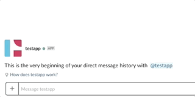

Slack - Lambda bot
=========

With this project you can instatiate a Slack bot which sends command to a Lambda function for processing.

The Deploy bot reacts to the following keywords:
- `help`: Shows a short help
- `hello`:  Say hi to you
- `action`: Perform a demo action by saving a simple json file in a S3 bucket

    

## Instructions

- Set the following environment variables:
1. `AWS_PROFILE`: the AWS CLI profile
2. `SLACK_SIGNING`: the Slack Signing Secret
3. `SLACK_BOT_TOKEN`: the Slack Bot User OAuth Access Token
5. `CIRCLECI_TOKEN`: the CircleCI token used to query CircleCI build status

Use `sls plugin install -n serverless-python-requirements` to install the requirements.txt serverless plugin.
Use `sls deploy` to deploy the lambda functions.

After deploying the functions, you need to insert the entrypoint function URL in the **Request URL** field in the "Event Subcriptions" section of the Slack bot page and you have to subscribe the bot to the `message.im` event. Instead, the handleuserchoice function URL must be inserted in the **Request URL** field in the "Interactive Components" section. You must enabled these two features if they aren't.
